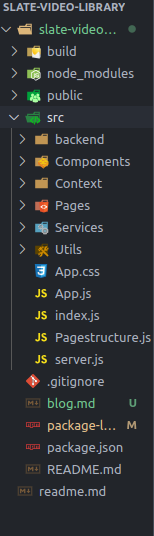
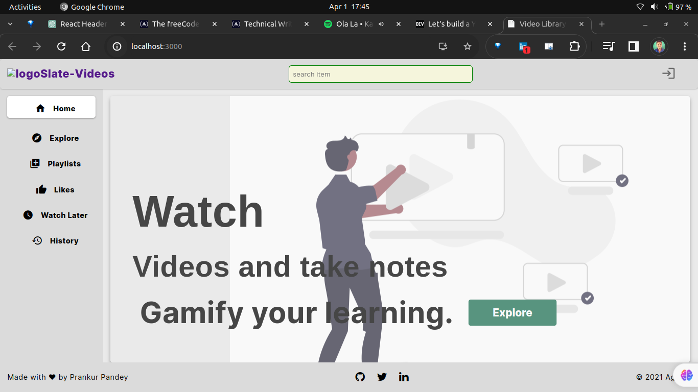

# How to build your own video library (Youtube Clone)

Youtube is an anazing platform as it has billions of videos and creators and allows the allows to open your own channel and later monetize it to make decent money .

Have you ever thought of building your own youtube like clone , yup I know thats too big to develop and maintain but as a side project you can definately try it out to test your skills and feel what it is like to develop your small version of youtube with an addition to some more features on top of it .

Today I will be guiding you to develop your own version of the small youtube app with some new features  keeping all the important features of the youtube.

I will be using the React JS ,Tailwind CSS and Mock API's.

# Folder Struture of the Project

I will be using the standard folder structure to sperate components and pages as it allows better manageemnt of files and data and improves the navigation inside project.

The Folder structure snaippets is here you can see :



Inside the main `` src`` directory  I have seperated the files and folders for eveyrthing backend folder is handling the all mock backend stuff, components folder has components which I will be using in project as React allows to break down big poages in compnents and later I can also reuse the compnents.

``Context `` folder has the useContext React API which is helping us in projects to manage the states the folder has useReducers code.

Pages folder is all about pages where each page of our app is assembeling the components .

Sevvices folder has the API calling methods there I am calling the API's and storing the response .

Utils contains  important code and small libraries or something which is not very common.

Rest other files are realted to projects in which App.js file is imporatnt one as it is the main file which holding the entire application.

# Lets Build

In the joureny of building the application first I will make all the imporatnt pages as it will give you the overview about the  application like how many pages you will need and which page would host and display what type of data .

If you have a situation where you have to show multiple pages and the count of the pages will increase with time then it would be technically impossible to make so many pages but React has a speical library where you can make as many pages as you want with respect to some unique URL to do so you will use React Router which allows to make dynamic pages.

This application has :

1. Homepage
2. Explore page
3. Playlist page
4. Liked video page
5. Watch later page
6. History page
7. Account manager page
8. Dynamic page to show each video

## Homepage

The homepage is the place where we show what is all about the product this application doenst has the fancy page as its is just a small demo project but I have put the all imporant information in a simple banner .

The page contains Header , footer and banner components and I will be using the same header and footer acroos the app.

The homepage looks like this



You can also see the React code for building the homepage

```

import React from "react";
import {
  Footer,
  Header,
  Hero,
  Sidebar,
} from "../../Components/IndexAllComponents";

import "./Homepage.css";
function Homepage() {
  return (
    <div>
      <Header />
      <Sidebar />
      <Hero />
      <Footer />
    </div>
  );
}

export default Homepage;

```

How clean the code is ,isnt it ? thats why I follow standard coding pratices and folder structure to improve the overall look of the code so that even a begginer can understand.

## Explore page

The explore page has all the videos which I am getting from the backend from the mock API , the page has two sections one sections has sidebar where I kept the indvidual page path and another section is displaying the overall video in video cards.

The page looks like this after its gets loaded :

Image->

You can also see the React code for building the Explore page

```
import {
  Chips,
  Footer,
  Header,
  Sidebar,
  Spinner,
  Videocard,
} from "../../Components/IndexAllComponents";
import { useExplorePageContext } from "../../Context/IndexAllContext";
import "./Explorepage.css";
function Explorepage() {
  const { finalData, isLoading } = useExplorePageContext();

  return (
    <div>
      <Header />
      <div className="explorepage-data">
        <Sidebar />
        <Chips />
        <div className="explorepage-videos-style">
          {isLoading ? (
            <Spinner />
          ) : (
            finalData.map((video) => {
              return <Videocard key={video._id} video={video} />;
            })
          )}
        </div>
      </div>
      <Footer />
    </div>
  );
}

export default Explorepage;
```

This code defines a React component called `Explorepage`, which is responsible for rendering a page for exploring videos. Let's break down the code:

1. **Imports**: The component imports necessary dependencies from external files, including React, custom components (`Chips`, `Footer`, `Header`, `Sidebar`, `Spinner`, `Videocard`), context (`useExplorePageContext`), and styles (`Explorepage.css`).
2. **Function Component**: The `Explorepage` function component is defined, which returns JSX to render the explore page.
3. **useExplorePageContext**: The `useExplorePageContext` hook is used to access context related to the explore page, such as `finalData` (list of videos to display) and `isLoading` (loading state).
4. **Rendering Explore Page**: Inside the returned JSX:

   - The `Header` component is displayed at the top.
   - The main content of the explore page is wrapped inside a `div` with the class `explorepage-data`.
   - The `Sidebar` component is included to provide navigation options.
   - The `Chips` component is rendered to provide filtering options or categories for videos.
   - The video cards are displayed inside a `div` with the class `explorepage-videos-style`. If the page is still loading (`isLoading` is `true`), a `Spinner` component is displayed. Otherwise, each video in `finalData` is mapped to a `Videocard` component, passing the video data as props.
5. **Footer**: Finally, the `Footer` component is displayed at the bottom of the page.
6. **Export**: The `Explorepage` component is exported as the default export.

Overall, this code creates a structured layout for the explore page, including header, sidebar, video cards, and footer. It dynamically renders videos fetched from the context, showing a spinner while loading. Additionally, it provides a layout that allows for easy navigation and exploration of videos.

## Playlist page

Playlist is a special where I add my personal favorite videos and later I can see and play it you can add multiple playlist and also add multiple videos into it.

The playlist page is the page where I am displaying the data of the playlist which will caryy all the videos which will be played one .

On playlist page you view the playlists and also remove it

Here is the code snippet :

```

import { Link, useEffect } from "../../Utils/CustomUtils";
import { usePlaylistContext } from "../../Context/IndexAllContext";
import "./Playlistspage.css";
import { Footer, Header, Sidebar } from "../../Components/IndexAllComponents";
import {
  getPlaylistsFn,
  removePlaylistFn,
} from "../../Services/PlaylistPageServices";

function Playlistspage() {
  const { addToPlaylists, setPlaylistFn } = usePlaylistContext();

  useEffect(() => {
    getPlaylistsFn(setPlaylistFn);
  }, []);

  return (
    <div>
      <Header />
      <div
        className="likes-page-sidebar"
        style={{ display: "flex", marginLeft: "15rem" }}
      >
        <Sidebar />
        <div className="playlist-container">
          {addToPlaylists.length <= 0 ? (
            <h3 className="historypage-title">
              {" "}
              THERE ARE NO PLAYLIST TO DISPLAY{" "}
            </h3>
          ) : (
            addToPlaylists &&
            addToPlaylists.map((playlistData) => (
              <div>
                <div className="playlistdata">
                  <span className="material-icons playlisticon">
                    playlist_play
                  </span>
                  <Link to={`/playlists/${playlistData._id}`}>
                    <div className="playlistpage">
                      Playlist {playlistData.playlistName}
                    </div>
                  </Link>
                </div>
                <span
                  className="material-icons playlistmi"
                  onClick={() =>
                    removePlaylistFn(playlistData._id, setPlaylistFn)
                  }
                >
                  delete
                </span>
              </div>
            ))
          )}
        </div>
      </div>

      <Footer />
    </div>
  );
}

export default Playlistspage;
```

This code is a React component called `Playlistspage`, which is responsible for rendering a page displaying playlists. Here's an explanation of the code:

1. **Imports**: The component imports necessary dependencies from external files, including React, custom utilities (`Link`, `useEffect`), context (`usePlaylistContext`), styles (`Playlistspage.css`), and components (`Footer`, `Header`, `Sidebar`).
2. **Function Component**: The `Playlistspage` function component is defined, which returns JSX to render the playlist page.
3. **usePlaylistContext**: The `usePlaylistContext` hook is used to access playlist-related context, such as `addToPlaylists` (list of playlists) and `setPlaylistFn` (function to update playlists).
4. **useEffect**: The `useEffect` hook is used to perform side effects in the component. Here, it fetches playlists when the component mounts using `getPlaylistsFn` and updates the playlist context using `setPlaylistFn`.
5. **Rendering Playlists**: The component renders playlists by mapping through `addToPlaylists` array. If there are no playlists (`addToPlaylists.length <= 0`), it displays a message indicating no playlists to display. Otherwise, it maps through each playlist in `addToPlaylists`, displaying its name and a delete icon (`material-icons`) to remove the playlist.
6. **Sidebar and Layout**: The `Sidebar` component is included to provide navigation options. The layout is structured with flexbox, ensuring that the sidebar and playlist container are displayed side by side.
7. **Footer and Return**: Finally, the `Footer` component is included at the bottom of the page, and the JSX for the component is returned for rendering.

Overall, this code fetches and displays playlists, allows users to navigate to individual playlists, and provides the option to delete playlists.

## Liked video page

Liked video page where I am adding or bookmarking all the videos which I liked and in future I would like to see that again.

The page looks like this  :

IMage ->

Here is the code snippet :

```
import React, { useEffect } from "react";
import {
  Footer,
  Header,
  Sidebar,
  SmallVideoCards,
} from "../../Components/IndexAllComponents";
import { useLikeContext } from "../../Context/IndexAllContext";
import {
  getLikedVideosFn,
  removeLikedVideosFn,
} from "../../Services/LikesPageServices";

import "./Likespage.css";
function Likespage() {
  const { getLikedVideos, setLikesFn } = useLikeContext();

  useEffect(() => {
    getLikedVideosFn(setLikesFn);
  }, []);

  return (
    <div>
      <Header />
      <div
        className="likes-page-sidebar"
        style={{ display: "flex", marginLeft: "15rem" }}
      >
        <Sidebar />
        <div className="likes-container">
          {getLikedVideos.length <= 0 ? (
            <h3 className="historypage-title">THERE ARE NO LIKED VIDEOS </h3>
          ) : (
            getLikedVideos.map((like) => (
              <div className="likesdata">
                <SmallVideoCards props={like.videoUrl} />
                <span
                  className="material-icons likesmi"
                  onClick={(_id) => removeLikedVideosFn(like._id, setLikesFn)}
                >
                  delete
                </span>
              </div>
            ))
          )}
        </div>
      </div>
      <Footer />
    </div>
  );
}

export default Likespage;
```

This code defines a React component called `Likespage`, which is responsible for rendering a page displaying liked videos. Let's break down the code:

1. **Imports**: The component imports necessary dependencies from external files, including React, custom components (`Footer`, `Header`, `Sidebar`, `SmallVideoCards`), context (`useLikeContext`), and services (`getLikedVideosFn`, `removeLikedVideosFn`).
2. **Function Component**: The `Likespage` function component is defined, which returns JSX to render the liked videos page.
3. **useEffect Hook**: The `useEffect` hook is used to perform side effects in the component. In this case, it fetches liked videos using the `getLikedVideosFn` service function when the component mounts (`[]` dependency array).
4. **Rendering Liked Videos Page**: Inside the returned JSX:

   - The `Header` component is displayed at the top.
   - The main content of the liked videos page is wrapped inside a `div` with the class `likes-page-sidebar`.
   - The `Sidebar` component is included to provide navigation options.
   - The liked videos are displayed inside a `div` with the class `likes-container`. If there are no liked videos (`getLikedVideos` length is `<= 0`), a message indicating the absence of liked videos is displayed. Otherwise, each liked video in `getLikedVideos` is mapped to a `div` containing a `SmallVideoCards` component to display the video and a delete button represented by a Material Icons icon.
   - The `Footer` component is displayed at the bottom of the page.
5. **Export**: The `Likespage` component is exported as the default export.

Overall, this code creates a structured layout for the liked videos page, including header, sidebar, video cards for liked videos, and footer. It dynamically renders liked videos fetched from the context and provides an option to delete liked videos.

## Watch later page

Watch later page is also similar to the liked video page as again here I am bookmarking the videos to watch later If I dont have time to watch the video right now and I would like to see that in future while in liked video page I have watched the video and really liked it.

here is how the page looks :

image ->

here is the code :

```
import { useEffect } from "../../Utils/CustomUtils";
import { useWatchLaterContext } from "../../Context/IndexAllContext";
import "./Watchlaterpage.css";
import {
  Footer,
  Header,
  Sidebar,
  SmallVideoCards,
} from "../../Components/IndexAllComponents";
import {
  getWatchLaterVideosFn,
  removeWatchLaterVideosFn,
} from "../../Services/WatchLaterServices";
function Watchlaterpage() {
  const { getWatchLaterVideos, setWatchLaterFn } = useWatchLaterContext();
```

  useEffect(() => {
    getWatchLaterVideosFn(setWatchLaterFn);
  }, []);

  return (
    `<div>`
      `<Header />`
      <div
        className="likes-page-sidebar"
        style={{ display: "flex", marginLeft: "15rem" }}
      >
        `<Sidebar />`
        `<div className="watchlater-container">`
          {getWatchLaterVideos.length <= 0 ? (
            `<h3 className="watchlaterpage-title">`
              THERE ARE NO WATCHLATER VIDEOS{" "}
            `</h3>`
          ) : (
            getWatchLaterVideos.map((watch_later) => (
              `<div className="watchlaterdata">`
                `<SmallVideoCards props={watch_later.videoUrl} />`
                <span
                  className="material-icons watchlatermi"
                  onClick={(_id) =>
                    removeWatchLaterVideosFn(watch_later._id, setWatchLaterFn)
                  }
                >
                  delete

    `</div>`
            ))
          )}
        `</div>`
      `</div>`
      `<Footer />`
    `</div>`
  );
}

export default Watchlaterpage;

This code defines a React component called `Watchlaterpage`, responsible for rendering a page displaying videos saved to watch later. Let's break down the code:

1. **Imports**: The component imports necessary dependencies from external files, including `useEffect` from custom utilities (`../../Utils/CustomUtils`), `useWatchLaterContext` from context (`../../Context/IndexAllContext`), custom components (`Footer`, `Header`, `Sidebar`, `SmallVideoCards`), and services (`getWatchLaterVideosFn`, `removeWatchLaterVideosFn`).
2. **Function Component**: The `Watchlaterpage` function component is defined, which returns JSX to render the watch later videos page.
3. **useEffect Hook**: The `useEffect` hook is used to perform side effects in the component. In this case, it fetches watch later videos using the `getWatchLaterVideosFn` service function when the component mounts (`[]` dependency array).
4. **Rendering Watch Later Videos Page**: Inside the returned JSX:

   - The `Header` component is displayed at the top.
   - The main content of the watch later videos page is wrapped inside a `div` with the class `likes-page-sidebar`.
   - The `Sidebar` component is included to provide navigation options.
   - The watch later videos are displayed inside a `div` with the class `watchlater-container`. If there are no watch later videos (`getWatchLaterVideos` length is `<= 0`), a message indicating the absence of watch later videos is displayed. Otherwise, each watch later video in `getWatchLaterVideos` is mapped to a `div` containing a `SmallVideoCards` component to display the video and a delete button represented by a Material Icons icon.
   - The `Footer` component is displayed at the bottom of the page.
5. **Export**: The `Watchlaterpage` component is exported as the default export.

Overall, this code creates a structured layout for the watch later videos page, including header, sidebar, video cards for watch later videos, and footer. It dynamically renders watch later videos fetched from the context and provides an option to remove them from the watch later list.

## History page

History is the past which I have viewed already or seen the same goes for the history page for the videos I have watched or performed any action on it such as liked or added the videos into watch list.

Here is how the history page looks like :

image->

here is the code snippet :

```
import { useEffect } from "../../Utils/CustomUtils";
import {
  useExplorePageContext,
  useHistoryContext,
} from "../../Context/IndexAllContext";
import "./Historypage.css";
import {
  Footer,
  Header,
  Sidebar,
  SmallVideoCards,
} from "../../Components/IndexAllComponents";
import {
  getHistoryFn,
  removeAllHistoryFn,
  removeVideoFromHistoryFn,
} from "../../Services/HistoryPageServices";

function Historypage() {
  const { getHistory, setHistoryFn } = useHistoryContext();
  const { finalData } = useExplorePageContext();

  useEffect(() => {
    getHistoryFn(setHistoryFn);
  }, [finalData]);

  return (
    <div>
      <Header />
      <div
        className="likes-page-sidebar"
        style={{ display: "flex", marginLeft: "15rem" }}
      >
        <Sidebar />

        <div className="watchlater-container">
          <button
            className="btn btn-danger clearallhistory"
            onClick={() => removeAllHistoryFn(setHistoryFn)}
          >
            clear history
          </button>

          {getHistory.length <= 0 ? (
            <h3 className="historypage-title">
              {" "}
              THE HISTORY IS EMPTY , WATCH SOMETHING TO ADD HERE{" "}
            </h3>
          ) : (
            getHistory.map((history) => (
              <div className="watchlaterdata">
                <SmallVideoCards props={history.videoUrl} />
                <span
                  className="material-icons watchlatermi"
                  onClick={(_id) =>
                    removeVideoFromHistoryFn(history._id, setHistoryFn)
                  }
                >
                  delete
                </span>
              </div>
            ))
          )}
        </div>
      </div>
      <Footer />
    </div>
  );
}

export default Historypage;
```

This code represents a React component for displaying a user's browsing history, typically related to watched videos. Here's a breakdown of what each part of the code does:

1. **Imports**: The component imports necessary dependencies including `useEffect` from CustomUtils, various context hooks (`useExplorePageContext` and `useHistoryContext`) from IndexAllContext, and UI components and services from respective directories.
2. **CSS**: The component imports a CSS file named `Historypage.css` for styling purposes.
3. **Function Component**: `Historypage` is a functional component that renders JSX. It fetches and displays the user's browsing history.
4. **Context Usage**: It uses the `useHistoryContext` hook to access the user's browsing history and a setter function to update it. Additionally, it utilizes the `useExplorePageContext` hook to access the `finalData`, which likely contains information about the videos the user has watched.
5. **useEffect Hook**: The `useEffect` hook is used to fetch the user's browsing history when the `finalData` changes. This ensures that the history is updated whenever the user watches a new video.
6. **Rendering**: The component renders a header, a sidebar, and a list of watched videos. If the history is empty, it displays a message prompting the user to watch something to add to their history. Otherwise, it displays the list of watched videos along with a button to clear all history.
7. **Event Handling**: Click events are attached to the "clear history" button and the delete icon next to each video. Clicking the "clear history" button triggers the `removeAllHistoryFn` function to remove all history entries. Clicking the delete icon triggers the `removeVideoFromHistoryFn` function to remove the corresponding video from the history.
8. **Footer**: Finally, the component renders a footer.

Overall, this component efficiently manages the user's browsing history, providing options to view, clear, and interact with the history entries. It effectively utilizes React hooks and context for state management and renders a user-friendly interface for the browsing history feature.

This code represents a React component for displaying a user's browsing history, typically related to watched videos. Here's a breakdown of what each part of the code does:

1. **Imports**: The component imports necessary dependencies including `useEffect` from CustomUtils, various context hooks (`useExplorePageContext` and `useHistoryContext`) from IndexAllContext, and UI components and services from respective directories.
2. **Function Component**: `Historypage` is a functional component that renders JSX. It fetches and displays the user's browsing history.
3. **Context Usage**: It uses the `useHistoryContext` hook to access the user's browsing history and a setter function to update it. Additionally, it utilizes the `useExplorePageContext` hook to access the `finalData`, which likely contains information about the videos the user has watched.
4. **useEffect Hook**: The `useEffect` hook is used to fetch the user's browsing history when the `finalData` changes. This ensures that the history is updated whenever the user watches a new video.
5. **Rendering**: The component renders a header, a sidebar, and a list of watched videos. If the history is empty, it displays a message prompting the user to watch something to add to their history. Otherwise, it displays the list of watched videos along with a button to clear all history.
6. **Event Handling**: Click events are attached to the "clear history" button and the delete icon next to each video. Clicking the "clear history" button triggers the `removeAllHistoryFn` function to remove all history entries. Clicking the delete icon triggers the `removeVideoFromHistoryFn` function to remove the corresponding video from the history.
7. **Footer**: Finally, the component renders a footer.

Overall, this component efficiently manages the user's browsing history, providing options to view, clear, and interact with the history entries. It effectively utilizes React hooks and context for state management and renders a user-friendly interface for the browsing history feature.

## Account manager page

The account manager page shows the data realted to your account where I am showing how may videos I have liked , how many playlist I have created and how many notes I have taken so far , yes  I have integrated one additional feature .

Here is how the page looks like :

image ->

the code snippet :

```
import {
  Accountdetails,
  Footer,
  Header,
  Sidebar,
} from "../../Components/IndexAllComponents";

function Accountpage() {
  return (
    <div>
      <Header />
      <div
        className="account-page-sidebar"
        style={{ display: "flex", marginLeft: "25rem" }}
      >
        <Sidebar />
        <Accountdetails />
      </div>
      <Footer />
    </div>
  );
}

export default Accountpage;

```

This code represents a React component named `Accountpage` responsible for rendering the user's account details page. Here's a breakdown of what each part of the code does:

1. **Imports**: The component imports necessary UI components (`Accountdetails`, `Footer`, `Header`, `Sidebar`) from the `IndexAllComponents` module.
2. **Function Component**: `Accountpage` is a functional component that renders JSX. It composes the account page layout using imported UI components.
3. **Rendering**: Within the `div` element, it renders the following components in order:

   - `<Header />`: Renders the header component, typically containing navigation links or branding elements.
   - `<Sidebar />`: Renders the sidebar component, which likely provides navigation options or secondary functionalities related to the account page.
   - `<Accountdetails />`: Renders the account details component, which presumably displays information such as user profile data, settings, or subscription details.
   - `<Footer />`: Renders the footer component, which often contains links, copyright information, or additional navigation.
4. **Styling**: Inline styling is applied to the container div to position the sidebar with a left margin of 25rem. This ensures proper alignment and layout of the sidebar and account details components.
5. **Export**: The `Accountpage` component is exported as the default export, making it accessible for use in other parts of the application.

Overall, this component encapsulates the structure and layout of the account page, combining various UI components to provide a cohesive user experience for viewing and managing account details.

## Dynamic page to show videos

When you land on the explore page you see the all the listed vidoes from the backend now you want to see the video and also wish to like it or dont have time to watch right now so you want to add it into watch later ,so technically its not pracical to give all these feature on explore page therefore having a seperate age will give more sense for each video

the dynamic page to show videos comes into the picture and this page is created where you do all the actions and also add the notes if you wish to note down something from the video.

You can take notes ,see the notes and also delete it .

here how the page looks like :

image->

the code snippet :

```
import React from "react";
import {
  Footer,
  Header,
  Sidebar,
  SingleVideo,
} from "../../Components/IndexAllComponents";

import "./SingleVideopage.css";

function SingleVideopage() {
  return (
    <div>
      <Header />
      <div className="sidebar-single-video">
        <Sidebar />
        <SingleVideo />
      </div>
      <Footer />
    </div>
  );
}

export default SingleVideopage;
```

This code represents a React component named `SingleVideopage`, which is responsible for rendering a page displaying a single video. Here's a breakdown of the code:

1. **Imports**: The component imports necessary UI components (`Footer`, `Header`, `Sidebar`, `SingleVideo`) from the `IndexAllComponents` module. These components are likely responsible for rendering the layout, navigation, and content related to the single video page.
2. **Function Component**: `SingleVideopage` is a functional component that renders JSX. It composes the single video page layout using the imported UI components.
3. **Rendering**: Within the `div` element, it renders the following components in order:

   - `<Header />`: Renders the header component, which typically contains navigation links or branding elements.
   - `<Sidebar />`: Renders the sidebar component, which likely provides navigation options or related videos/thumbnails.
   - `<SingleVideo />`: Renders the single video component, which displays the main content of the page, such as the video player and associated metadata.
   - `<Footer />`: Renders the footer component, which often contains links, copyright information, or additional navigation.
4. **Styling**: The CSS class `sidebar-single-video` is applied to the container `div` to style the layout of the sidebar and single video components. The actual styles are defined in an external CSS file (`SingleVideopage.css`), which is imported at the top of the file.
5. **Export**: The `SingleVideopage` component is exported as the default export, making it accessible for use in other parts of the application.

Overall, this component encapsulates the structure and layout of the single video page, combining various UI components to provide a cohesive user experience for viewing a specific video content.

### Inside the video card :

```

import { Link } from "../../Utils/CustomUtils";
import {
  useHistoryContext,
  useSingleVideoContext,
} from "../../Context/IndexAllContext";

import "./Videocard.css";
import { addToHistoryFn } from "../../Services/HistoryPageServices";
function Videocard({ video }) {
  const { _id, title, videoUrl, creator_pic } = video;
  const { setHistoryFn } = useHistoryContext();
  const { videoData } = useSingleVideoContext();

  return (
    <div>
      <div className="video__cards">
        <div class="card-wrapper video-card">
          <div>
            <embed class="iframe-video" src={videoUrl} title="video"></embed>
          </div>
          <Link to={`/explore/${_id}`}>
            <div className="video__cards-details">
              <div className="video__cards-image">
                
              </div>
              <div
                className="video__cards-title"
                onClick={() => addToHistoryFn(videoData, setHistoryFn)}
              >
                <h3>{title} </h3>
              </div>
            </div>
          </Link>
        </div>
      </div>
    </div>
  );
}

export default Videocard;
```

This code defines a React component called `Videocard`, which represents a card displaying information about a video. Here's a breakdown of the code:

1. **Imports**:

   - `Link`: This component is imported from the `CustomUtils` module, likely for routing purposes.
   - `useHistoryContext` and `useSingleVideoContext`: These are custom hooks imported from the `IndexAllContext` module. They are used to access and manipulate state related to the user's browsing history and the currently selected single video, respectively.
   - `addToHistoryFn`: This function is imported from the `HistoryPageServices` module. It is likely used to add a video to the user's browsing history.
2. **Function Component**:

   - The `Videocard` component is a functional component that accepts a `video` object as a prop.
   - Within the component, destructuring is used to extract specific properties (`_id`, `title`, `videoUrl`, `creator_pic`) from the `video` object.
3. **Rendering**:

   - The component renders JSX to represent a video card.
   - It consists of a `div` with the class `video__cards`, which contains a card-wrapper (`div` with the class `card-wrapper video-card`).
   - Inside the card wrapper, an `embed` element is used to embed the video specified by the `videoUrl`.
   - The video card also includes details such as the creator's profile picture (`creator_pic`) and the video title (`title`). These details are wrapped inside a `Link` component, which likely links to the video's detailed page (`/explore/${_id}`).
   - An `onClick` event handler is attached to the `video__cards-title` element. When clicked, it calls the `addToHistoryFn` function with the `videoData` and `setHistoryFn` arguments.
4. **Styling**:

   - The CSS class `video__cards` is applied to style the overall layout of the video card.
   - Additional styling is applied using external CSS defined in the `Videocard.css` file.
5. **Export**:

   The `Videocard` component is exported as the default export, making it available for use in other parts of the application.

   ### The Note taking functionality :

   I believe in development as a real software engineers its the responsibility to handle the application development therefore in this application I have added on small feature on top the app this feature allows you to take notes while keep watching the videos ,you can see the notes on the same page where you are watching the videos and also delete it , there's no rich text support for the taking notes will be completly in plain text.

   the code snippet:


   ```
   import React from "react";
   import {
     useNotesAppContext,
     useSingleVideoContext,
   } from "../../Context/IndexAllContext";

   import "./NoteTaking.css";
   function NoteTaking() {
     const { notesTakingBoxState } = useSingleVideoContext();

     const {
       inputNotesTextValue,
       setinputNotesTextValue,
       saveNotesFn,
       inputNotesData,
       deleteNotesFn,
       editNotesFn,
       buttonState,
     } = useNotesAppContext();

     return (
       <div
         className="notes-container"
         style={{
           display: notesTakingBoxState,
         }}
       >
         <div class="form-data">
           <form onSubmit={saveNotesFn}>
             <input
               type="text"
               className="notes-app"
               value={inputNotesTextValue}
               onChange={(e) => setinputNotesTextValue(e.target.value)}
               required
               placeholder="take notes "
             />
             <input type="submit" class="submit-notes" />
           </form>
           <div>
             <div>
               <table>
                 <tr>
                   <th className="notes-data">Notes</th>
                   <th>
                     <span class="notesmi">Action</span>
                     {/* <span class="material-icons notesmi">edit</span> */}
                   </th>
                 </tr>
                 {inputNotesData.map((text) => (
                   <tr>
                     <td className="notes-data"> {text.inputNotesTextValue} </td>
                     <td>
                       {/* <button className="btns">
                         <span
                           class="material-icons notesmi"
                           onClick={(_id) => editNotesFn(text._id)}
                         >
                           edit
                         </span>
                       </button> */}

                       <span
                         class="material-icons notesmi"
                         onClick={(_id) => deleteNotesFn(text._id)}
                       >
                         delete
                       </span>
                     </td>
                   </tr>
                 ))}
               </table>
             </div>
           </div>
         </div>
       </div>
     );
   }

   export default NoteTaking;
   ```

This code defines a React component called `NoteTaking`, which represents a note-taking feature within a larger application. Let's break down the code:

1. **Imports**:

   - `useNotesAppContext` and `useSingleVideoContext`: These are custom hooks imported from the `IndexAllContext` module. They are used to access and manipulate state related to note-taking functionality and the context of a single video, respectively.
2. **Function Component**:

   - The `NoteTaking` component is a functional component that doesn't receive any props.
   - Inside the component, destructuring is used to extract specific values from the `useSingleVideoContext` and `useNotesAppContext` hooks.
3. **Rendering**:

   - The component renders JSX to represent a note-taking interface.
   - It consists of a `div` with the class `notes-container`, which has its display property determined by the `notesTakingBoxState`.
   - Inside the container, there's a form for inputting notes. The form's submission is handled by the `saveNotesFn` function.
   - Below the form, there's a table displaying the existing notes (`inputNotesData`). Each note is rendered as a row in the table.
   - Each note includes its text in the first column (`td`) and an action (such as deletion) in the second column.
4. **Event Handling**:

   - The `onChange` event of the input field updates the `inputNotesTextValue` state with the typed note text.
   - Clicking the submit button triggers the `saveNotesFn` function to save the note.
   - Clicking the delete icon triggers the `deleteNotesFn` function to remove the corresponding note.
5. **Styling**:

   - The component applies styling using the `NoteTaking.css` file, which likely contains CSS rules for layout and presentation.
6. **Export**:

   The `NoteTaking` component is exported as the default export, making it available for use in other parts of the application.

   ## Conclusion :

Finnaly I thoirigly enjoyed building this small youtube clone as it has given me deeper understaing of the React development and various other tools of React ecosystem, here is the breakdown of the technolgies I have learned  :

* ReactJS
* React Router v6
* React Context API and useReducer
* React Player
* [Slate UI](https://slateui.netlify.app/) - CSS Component Library
* MockBee
* React Hot Toast**here is the feature list of the application :**
* Video Listing page
* Like/dislike a video
* Playlist Management
* Watchlater Management
* History Management
* Filter videos by category
* Sort videos by date
* Search videos
* Authentication
* Take/Delete Notes

Thanks for Reading it you can see the complete code on [github](https://github.com/prankurpandeyy/Slate-Store/tree/development/agri-store-react/src) and can browse the project [here](https://github.com/prankurpandeyy/Slate-Video-Library/tree/development/slate-video-library)

If you have anything to share with me or want me to develop some web app I am always open to opportunities you can connect here on [Linkedin](https://www.linkedin.com/in/prankurpandeyy/)
